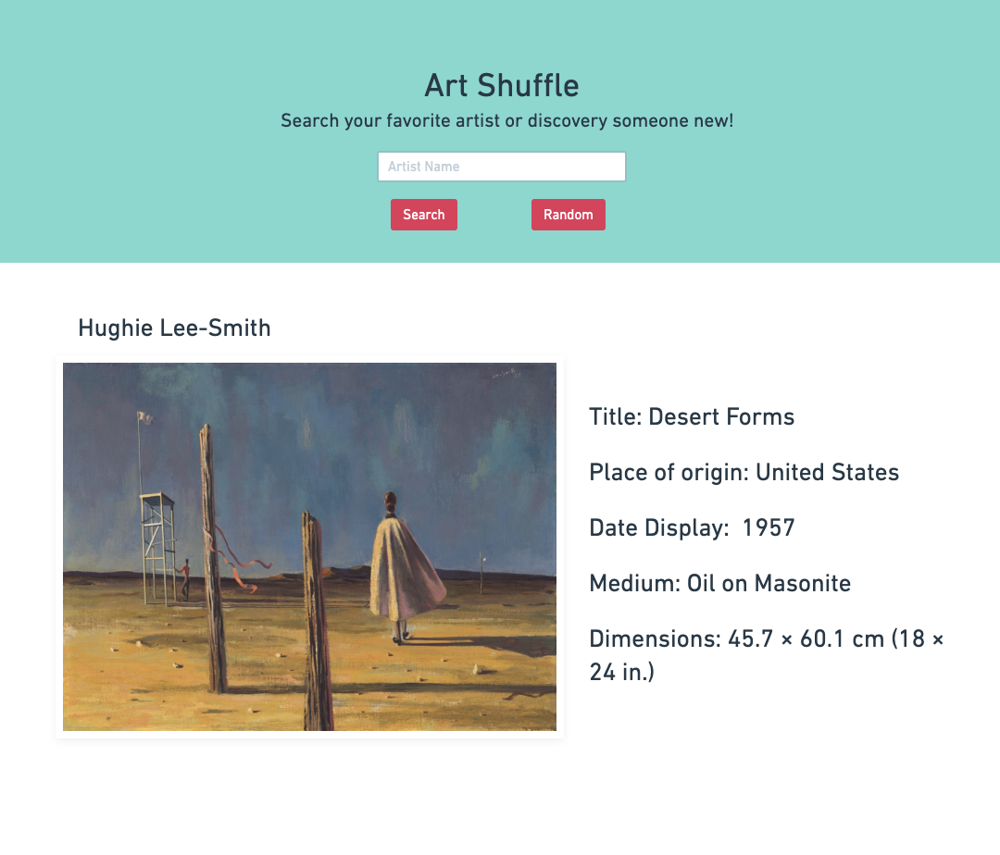
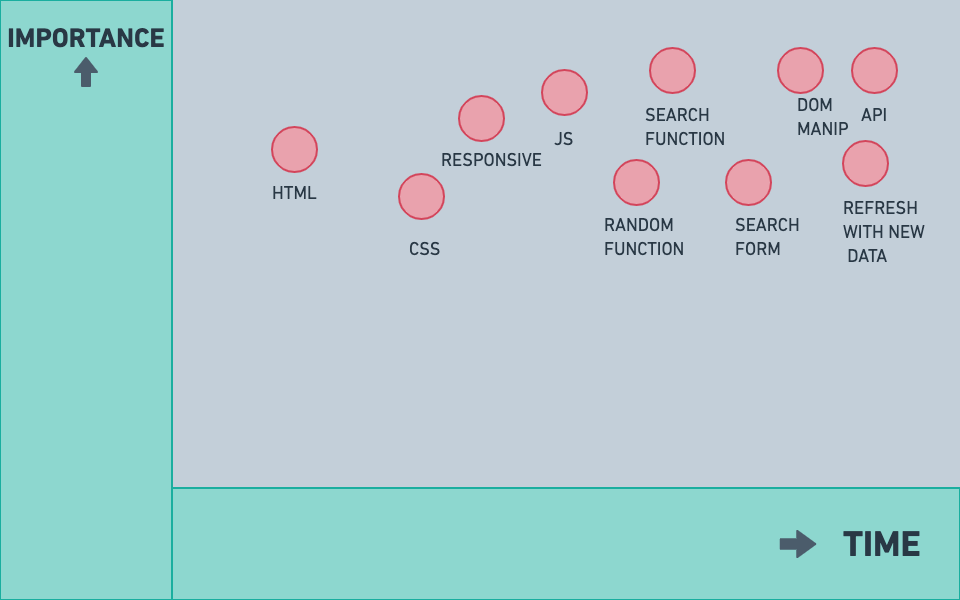

# Art Shuffle

[Live Demo Link](https://virginiebonhomme.github.io/Art-Shuffle/)

# Project Overview

## Project Name

Art Shuffle

## Project Description

Art Shuffle is an application that allows users to search their favorite fine artist or discover a new one through a random search.

## API and Data Sample

Art Institute of Chicago API
https://api.artic.edu/api/v1/artworks?limit=2


``` data": [
{
"id": 8969,
"api_model": "artworks",
"api_link": "https://api.artic.edu/api/v1/artworks/8969",
"is_boosted": false,
"title": "Beggar with Oysters (Philosopher)",
"alt_titles": null,
"thumbnail": {
"lqip": "data:image/gif;base64,R0lGODlhAwAFAPMAABAQDRMRDhMSDxQSDhgUDwkRFBESEBgVEB8bFRoaGBgcHColIDs0Kkc+L0hBNgAAACH5BAAAAAAALAAAAAADAAUAAAQL8CAi1ADFrBQcaxEAOw==",
"width": 1312,
"height": 2250,
"alt_text": "A work made of oil on canvas."
},
"main_reference_number": "1931.504",
"has_not_been_viewed_much": false,
"boost_rank": null,
"date_start": 1860,
"date_end": 1870,
"date_display": "1865/67",
"date_qualifier_title": "",
"date_qualifier_id": null,
"artist_display": "Édouard Manet\nFrench, 1832-1883",
"place_of_origin": "France",
"dimensions": "188.0 × 111.0 cm (74 × 43 5/16 in.)",
"medium_display": "Oil on canvas",
"inscriptions": "Inscribed lower left: Manet",
"credit_line": "Arthur Jerome Eddy Memorial Collection",
```

## Wireframes



 

#### MVP 

- Find and use external api 
- Render data on page 
- Allow user to search fine artist by name
- Allow user to search for random artist

#### PostMVP  

- Add second API
- Allow user to like their favorite painting and store it on local page
- Allow user to search artist avilible cataloge. 

## Project Schedule

|  Day | Deliverable | Status
|---|---| ---|
|Dec 10-12| Prompt / Wireframes / Priority Matrix / Timeframes | complete
|Dec 13| Project Approval | complete
|Dec 13| Core Application Structure (HTML, CSS,) | complete
|Dec 14| Pseudocode / actual code | complete
|Dec 15| Initial Clickable Model  | complete
|Dec 16| MVP | complete
|Dec 17| Presentations | Incomplete

## Priority Matrix



## Timeframes
 

| Component | Priority | Estimated Time | Time Invested | Actual Time |
| --- | :---: |  :---: | :---: | :---: |
| INFRASTRUCTURE: | -| -| - | - |
| core Html, CSS, | H | 4hrs| 4hrs | 4hrs |
| JavaScript | H | 4hrs| 5hrs | 7hrs |
| DATA| - | -| - | - |
| Access API | H | 4hrs| 4hrs | 4hrs |
| DOM Manipulation | H | 4hrs| 4hrs | 4hrs |
| DESIGN| - | -| - | - |
| Responsive | H | 4hrs| 4hrs | 3hrs |
| FUNCTIONS | -| -| - | - |
| Search Form Function| H | 4hrs| 4hrs |
| Search Button Function | H | 4hrs| 4hrs | 4hrs |
| Random Button Function | H | 4hrs| 4hrs | 4hrs |
| Total | H | 36hrs| 37hrs| 35hrs |


## Code Snippet

This code snippet is from my CSS, for my search form. I am proud that I was able to make it look similar to my wire frame and was also able to add a hover button.  

```
.search-form {
  display: flex;
  align-items: flex-start;
  flex-direction: row;
    flex-wrap: wrap;
    justify-content: center;
    
}

#search-button {
  margin-right: 20px;
  background-color: rgb(10, 18, 227);

}
#search-button:hover {
  background-color: yellow;
  color : black
}

#random-button:hover {
  background-color: yellow;
  color : black
}

button {
  padding: 10px 10px 10px 10px;
  color:ghostwhite;
  font-family: sans-serif;
  font-size: 16px;
    letter-spacing: 2px;
    border-radius: 12px
}


#random-button {
  background-color: rgb(242, 45, 45);
    
}
```

## Change Log
